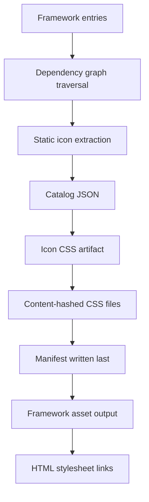

# Iconcat CSS Loading And Framework Integration

This document summarizes how Iconcat CSS is generated, installed, and loaded by
framework adapters. The goal is to keep icon CSS small in production while
preserving a fast development loop.

## Core Model

Iconcat production extraction is entry-driven:

1. Resolve framework entries from config or presets.
2. Traverse each entry's reachable dependency graph.
3. Extract static icon references and `defineIconcatIcons()` whitelists.
4. Write `.iconcat/catalog.json`.
5. Generate independent content-hashed icon CSS files.
6. Write `.iconcat/manifest.json` last.
7. Let the framework adapter install or emit those CSS files and render links.

Development does not run catalog extraction on every route interaction. Example
apps keep Tailwind dynamic icon selectors available in development, so new icons
can appear immediately during local iteration.



## Artifact Modes

Iconcat supports two CSS artifact modes.

| Mode     | Behavior                                                                                         |
| -------- | ------------------------------------------------------------------------------------------------ |
| `global` | All extracted icons are emitted as globally loaded CSS. This is the simplest production model.   |
| `page`   | Entries with `scope: 'global'` are globally loaded; other entries are emitted as page CSS files. |

`scope` and `priority` are independent:

- `scope` decides whether an entry contributes to global CSS or page CSS.
- `priority` affects page CSS load ordering, such as Pages Router preload or
  helper ordering.

In page mode, Iconcat also auto-promotes framework shell entries to global icon
CSS:

- Next App Router `layout.*` entries that are present in every resolved page
  route;
- Next Pages Router root `_app.*` entries under `pages` or `src/pages`.

This removes the need to manually mark the root layout or `_app` as global when
the framework already proves that every page uses it. The promotion happens only
in the CSS artifact/manifest layer; the extracted catalog still records the
original entry metadata.

Next presets and App Router route resolution support Next-style
`pageExtensions` whose final extension is JavaScript or TypeScript:
`js`, `jsx`, `ts`, or `tsx`. If the app uses compound suffixes such as
`.page.tsx`, pass the same list that appears in `next.config.js`:

```ts
import { nextApp, nextPages } from '@iconcat/presets'

nextApp({ pageExtensions: ['page.tsx', 'page.ts'] })
nextPages({ pageExtensions: ['page.tsx', 'page.ts'] })
```

This matches App Router files like `page.page.tsx`, `layout.page.tsx`, and
`template.page.tsx`, plus Pages Router files like `index.page.tsx`. MDX routes
are intentionally out of scope for this phase.

When `pageExtensions` is not provided, App Router ancestor probing uses all
default JavaScript and TypeScript extensions. This matches default Next projects
where segment files can mix extensions, such as `src/app/page.jsx` with
`src/app/layout.tsx`. When `pageExtensions` is provided, Iconcat probes only
that configured list so custom suffixes such as `page.tsx` do not accidentally
pull in files that Next would ignore.

Page-mode global CSS is always emitted as priority CSS. Users normally only
configure `priority` for page-scoped entries.

The CSS file name is based only on the generated CSS content hash:

```text
iconcat.[hash].css
```

The file name intentionally does not encode `global`, `page`, `priority`, or
route names. The manifest carries that metadata. Identical CSS content can share
the same hashed file and benefit from browser cache reuse.

## Manifest Handoff

The manifest is the stable contract between extraction and framework adapters.
CSS files are written before the manifest, and writes use an atomic temporary
file plus rename flow. A framework adapter should only read the manifest after
extraction has finished.

Global mode manifest shape:

```json
{
  "version": 1,
  "mode": "global",
  "files": {
    "priority": {
      "file": "iconcat.5b60030fc4.css",
      "hash": "5b60030fc4",
      "href": "/_next/static/css/iconcat.5b60030fc4.css",
      "icons": 1
    },
    "normal": {
      "file": "iconcat.f3fac45070.css",
      "hash": "f3fac45070",
      "href": "/_next/static/css/iconcat.f3fac45070.css",
      "icons": 5
    }
  },
  "icons": 6
}
```

Page mode manifest shape:

```json
{
  "version": 1,
  "mode": "page",
  "global": [
    {
      "file": "iconcat.5b60030fc4.css",
      "hash": "5b60030fc4",
      "href": "/_next/static/css/iconcat.5b60030fc4.css",
      "icons": 1,
      "priority": true
    }
  ],
  "pages": {
    "src/app/dashboard/page.tsx": [
      {
        "file": "iconcat.f3fac45070.css",
        "hash": "f3fac45070",
        "href": "/_next/static/css/iconcat.f3fac45070.css",
        "icons": 5
      }
    ]
  },
  "icons": 6
}
```

In page mode, page CSS subtracts global icons before hashing. Shell icons are not
duplicated in page CSS.

## Loading Rules

All adapters follow these rules:

- Production links Iconcat CSS as a separate stylesheet artifact.
- Development skips catalog CSS links and relies on Tailwind's dynamic icon
  selectors.
- Global CSS is loaded by the shell or HTML document.
- Page CSS is loaded only when the framework can resolve the current page at
  SSR, SSG, or build-time HTML generation.
- Priority files are ordered before non-priority files.
- Href-only APIs are convenience views; file-based APIs preserve metadata such
  as `priority`.

## Next.js App Router

Next App Router uses React's managed stylesheet model. Iconcat App Router
helpers render:

```tsx
<link rel='stylesheet' href='/_next/static/css/iconcat.hash.css' precedence='next' />
```

React serializes `precedence` as `data-precedence` in HTML and uses it for
stylesheet ordering and deduplication. Iconcat does not emit a manual
`rel="preload" as="style"` link for App Router; a preload alone would not
participate in React's stylesheet model.

### Global Mode

Recommended build sequence:

```bash
pnpm run extract
next build
node scripts/install-iconcat-css.mjs
```

Recommended public path:

```ts
import { createNextIconcatPublicPath } from '@iconcat/next'

const publicPath = createNextIconcatPublicPath({
  assetPrefix: process.env.NEXT_PUBLIC_ASSET_PREFIX,
})
```

Recommended layout integration:

```tsx
import { IconcatAppRouterStylesheets } from '@iconcat/next/app-router'

const iconcatManifest = process.env.ICONCAT_MANIFEST || '.iconcat/manifest.json'

export default function Layout({ children }: { children: React.ReactNode }) {
  return (
    <html lang='en'>
      <head>
        <IconcatAppRouterStylesheets manifest={iconcatManifest} />
      </head>
      <body>{children}</body>
    </html>
  )
}
```

Keep shell entries narrow. If the root layout imports a demo helper containing
many icon string literals, those icons become reachable from the global entry
and will be promoted into global CSS.

### Page Mode

Page mode uses the same config file with an environment switch in the examples:

```ts
const isPageMode = process.env.ICONCAT_MODE === 'page'
const iconcatDir = isPageMode ? '.iconcat/page-mode' : '.iconcat'
const nextAppEntries = nextApp().entries
const nextAppPageEntries = nextAppEntries.filter((entry) => entry.includes('/page.'))

export default defineIconcatConfig({
  entries: isPageMode
    ? nextAppPageEntries
    : [
        { file: 'src/app/layout.tsx', priority: true },
        ...nextAppEntries.filter((entry) => entry !== 'src/app/layout.tsx'),
      ],
  output: `${iconcatDir}/catalog.json`,
  artifacts: [
    createIconcatCSSArtifact({
      artifactMode: isPageMode ? 'page' : 'global',
      output: `${iconcatDir}/iconcat.[hash].css`,
      manifest: `${iconcatDir}/manifest.json`,
      publicPath,
    }),
  ],
})
```

In page mode the user config can be page entries only. Iconcat resolves the
known App Router segment files, including layouts, from each page during
extraction, records the route mapping in `manifest.routes`, and the runtime
helper reads that mapping. Common `layout.*` entries that appear in every
resolved page route are promoted to global CSS automatically.

The resolver lives in `@iconcat/adapter-utils/next-app-router` so it can be
reused outside the Next adapter. DeepWiki review of Next.js internals shows
that the real source of truth is Next's private LoaderTree and CSS resource
injection flow, and Next does not currently expose a public API for external
route-tree or CSS-resource resolution. Iconcat keeps its approximation behind
this single module; if Next.js exposes an official App Router route-tree API
later, this module is the replacement point.

The resolver has two extension-probing modes:

- without custom `pageExtensions`, it probes `js`, `jsx`, `ts`, and `tsx` for
  every ancestor segment file, so mixed JS/TS App Router trees keep their
  layout, template, loading, and error icons;
- with custom `pageExtensions`, it probes exactly the configured extensions,
  preserving Next's route-file contract for compound suffixes like
  `page.tsx`.

This keeps the page entry config small while still following the complete
reachable segment tree during extraction.

The current external resolver covers standard ancestor segment files:

```text
layout
template
error
loading
not-found
forbidden
unauthorized
default
```

It also includes `default.*` files from direct parallel route slots under each
ancestor segment, such as `src/app/dashboard/@modal/default.tsx`. Active
parallel slot pages cannot be derived exactly from a single leaf page path
outside Next's private LoaderTree. Declare those slot pages as page entries as
well, or replace the resolver with the official API if Next exposes one later.

Route components render page CSS with the route path. The artifact manifest
stores a `pageRoutes` map from route path to source entry, so application code
does not need to know `src/app/.../page.tsx` paths:

```tsx
import { IconcatAppRouterPageStylesheets } from '@iconcat/next/app-router'

const iconcatManifest = process.env.ICONCAT_MANIFEST || '.iconcat/manifest.json'

export default function Page() {
  return (
    <>
      <IconcatAppRouterPageStylesheets
        manifest={iconcatManifest}
        page='/dashboard/reports'
      />
      {/* page content */}
    </>
  )
}
```

This is the formal integration surface. Page loading helpers accept route paths,
not source entry paths, and expose that contract as the `IconcatPageRoute`
template type (`/${string}`). If a requested route path is missing from the
generated manifest, Iconcat throws during server rendering or build instead of
silently omitting CSS; that usually means the manifest is stale or the declared
route does not match the actual extracted page set. The example app also
contains an
`iconcat-manifest.ts` file, but that file is only a demo observability helper for
showing loaded hrefs and icon source labels on screen. A real App Router app
does not need that helper; it can pass the manifest path directly as shown
above.

The generated manifest records both the public route aliases and the resolved
entry chain for each App Router page:

```json
{
  "pageRoutes": {
    "/dashboard/reports": "src/app/dashboard/reports/page.tsx"
  },
  "routes": {
    "src/app/dashboard/reports/page.tsx": [
      "src/app/layout.tsx",
      "src/app/dashboard/error.tsx",
      "src/app/dashboard/loading.tsx",
      "src/app/dashboard/@analytics/default.tsx",
      "src/app/dashboard/reports/layout.tsx",
      "src/app/dashboard/reports/not-found.tsx",
      "src/app/dashboard/reports/page.tsx"
    ]
  }
}
```

`manifest.pages` and `manifest.routes` intentionally keep source entries as
internal artifact keys. Application code should not pass those keys to page
loading helpers; use `pageRoutes` route paths instead.

The helper first resolves `/dashboard/reports` through `manifest.pageRoutes`,
then reads the App Router entry chain from `manifest.routes`. If an older
manifest does not contain that route-chain mapping, it falls back to
conventional file-system ancestor inference:

```text
src/app/layout.tsx
src/app/template.tsx
src/app/error.tsx
src/app/loading.tsx
src/app/not-found.tsx
src/app/forbidden.tsx
src/app/unauthorized.tsx
src/app/default.tsx
src/app/dashboard/layout.tsx
src/app/dashboard/template.tsx
src/app/dashboard/error.tsx
src/app/dashboard/loading.tsx
src/app/dashboard/not-found.tsx
src/app/dashboard/forbidden.tsx
src/app/dashboard/unauthorized.tsx
src/app/dashboard/default.tsx
src/app/dashboard/reports/layout.tsx
src/app/dashboard/reports/template.tsx
src/app/dashboard/reports/error.tsx
src/app/dashboard/reports/loading.tsx
src/app/dashboard/reports/not-found.tsx
src/app/dashboard/reports/forbidden.tsx
src/app/dashboard/reports/unauthorized.tsx
src/app/dashboard/reports/default.tsx
src/app/dashboard/reports/page.tsx
```

That allows icons declared in nested layouts, templates, loading states, error
boundaries, access fallback files, and direct slot defaults to load with the
leaf route without manually rendering helpers in every ancestor. In other
words, nested App Router segment support is built into
`IconcatAppRouterPageStylesheets`; the page only needs to provide its route
path.

## Next.js Pages Router

Pages Router uses the legacy document head pipeline. Iconcat wraps
`next/document`'s `Head` and appends Iconcat CSS links during production
rendering.

In page mode, root `_app.*` entries under `pages` or `src/pages` are
auto-promoted to global icon CSS. Keep `_app` as a real extraction entry so its
dependency graph is still traversed, but do not mark it as `scope: 'global'`
manually:

```ts
import { nextPages } from '@iconcat/presets'

const nextPagesPreset = nextPages()

export default defineIconcatConfig({
  entries: [
    'src/pages/_app.tsx',
    ...nextPagesPreset.entries.filter((entry) => entry !== 'src/pages/_app.tsx'),
  ],
  presets: [
    {
      ...nextPagesPreset,
      entries: [],
      exclude: [
        ...(nextPagesPreset.exclude || []),
        'pages/_document.{js,jsx,ts,tsx}',
        'src/pages/_document.{js,jsx,ts,tsx}',
      ],
    },
  ],
})
```

The artifact writer moves `_app` icons into the page-mode global file, marks
that file as priority, and subtracts those icons from each page CSS file. This
keeps shared shell icons out of page CSS without requiring every Pages Router
app to learn Iconcat-specific scope metadata.

### Global CSS In `_document`

```tsx
import { createIconcatDocumentHead } from '@iconcat/next/pages-router'
import Document, { Head, Html, Main, NextScript } from 'next/document'

const IconcatHead = createIconcatDocumentHead(Head, {
  manifest: process.env.ICONCAT_MANIFEST || '.iconcat/manifest.json',
})

export default class AppDocument extends Document {
  render() {
    return (
      <Html>
        <IconcatHead />
        <body>
          <Main />
          <NextScript />
        </body>
      </Html>
    )
  }
}
```

The wrapped head:

- keeps Next's original CSS links;
- preloads priority Iconcat CSS;
- appends stylesheet links for all global Iconcat CSS files.

### Page CSS In SSG Or SSR Props

Pages Router page CSS is resolved in data methods and rendered with `next/head`.
This keeps the page's CSS hrefs in the server-rendered HTML.

SSG example:

```ts
import { getIconcatPageCSSFiles } from '@iconcat/next'

export function getStaticProps() {
  return {
    props: {
      iconcatPageCSSFiles: getIconcatPageCSSFiles('/dashboard', {
        manifest: process.env.ICONCAT_MANIFEST || '.iconcat/manifest.json',
      }),
    },
  }
}
```

SSR example:

```ts
import { getIconcatPageCSSFiles } from '@iconcat/next'

export function getServerSideProps() {
  return {
    props: {
      iconcatPageCSSFiles: getIconcatPageCSSFiles('/settings', {
        manifest: process.env.ICONCAT_MANIFEST || '.iconcat/manifest.json',
      }),
    },
  }
}
```

Pages Router uses the same `pageRoutes` lookup. For example, `/dashboard`
resolves to `src/pages/dashboard/index.tsx` and `/settings` resolves to
`src/pages/settings/index.tsx`. Page loading helpers accept only those route
paths; missing route keys throw the same fail-fast error as App Router.

Render example:

```tsx
import Head from 'next/head'

export function IconcatPageStylesheet({ files }) {
  return files.length
    ? (
        <Head>
          {files.filter((file) => file.priority).map((file) => (
            <link as='style' href={file.href} key={`preload:${file.href}`} rel='preload' />
          ))}
          {files.map((file) => (
            <link href={file.href} key={file.href} rel='stylesheet' />
          ))}
        </Head>
      )
    : null
}
```

Pages Router can use manual preload for priority page CSS because it is not
using React App Router's managed stylesheet path.

## Vite And React Router

Vite has the cleanest plugin boundary because it supports build hooks, asset
emission, and HTML transformation.

The `@iconcat/vite` plugin:

1. starts extraction in `buildStart()` without awaiting it;
2. waits for extraction in `generateBundle()`;
3. emits every CSS file listed by the manifest as a Rollup asset;
4. waits for the same extraction in `transformIndexHtml()`;
5. injects global stylesheet links into `index.html`.

```ts
import { reactRouter } from '@iconcat/presets'
import { createIconcatCSSArtifact } from '@iconcat/tailwind/catalog-css'
import { createViteIconcatPublicPath, iconcat } from '@iconcat/vite'
import react from '@vitejs/plugin-react'
import { createEsbuildBundler } from 'iconcat'
import { defineConfig } from 'vite'

const base = process.env.VITE_BASE || '/'
const isPageMode = process.env.ICONCAT_MODE === 'page'
const iconcatDir = isPageMode ? '.iconcat/page-mode' : '.iconcat'
const publicPath = createViteIconcatPublicPath(base)

export default defineConfig({
  base,
  plugins: [
    react(),
    iconcat({
      presets: [reactRouter()],
      output: `${iconcatDir}/catalog.json`,
      bundler: createEsbuildBundler(),
      artifacts: [
        createIconcatCSSArtifact({
          artifactMode: isPageMode ? 'page' : 'global',
          output: `${iconcatDir}/iconcat.[hash].css`,
          manifest: `${iconcatDir}/manifest.json`,
          publicPath,
        }),
      ],
    }),
  ],
})
```

For a React Router SPA, there is no server-rendered current route at
`index.html` generation time. The current integration therefore injects global
Iconcat CSS into `index.html`. Route-level client-side page CSS loading is a
future adapter capability, not part of the current Vite runtime contract.

## Public Paths And Asset Installation

Next.js:

- use `createNextIconcatPublicPath()`;
- include `assetPrefix` when configured;
- install files into `.next/static/css`;
- link `/_next/static/css/iconcat.[hash].css`.

Vite:

- use `createViteIconcatPublicPath(base, assetsDir)`;
- emit CSS through Rollup assets;
- link `/assets/iconcat.[hash].css` by default.

Iconcat should not copy production CSS into Next's `public` directory. Next's
`assetPrefix` is designed around `/_next/static` assets, while `public` files
require each caller to apply CDN prefix behavior manually.

## Current Example Commands

Default global mode:

```bash
pnpm --filter @iconcat/example-next-app-router run build
pnpm --filter @iconcat/example-next-pages-router run build
pnpm --filter @iconcat/example-react-router-vite run build
```

Page mode extraction:

```bash
ICONCAT_MODE=page pnpm --filter @iconcat/example-next-app-router run extract
ICONCAT_MODE=page pnpm --filter @iconcat/example-next-pages-router run extract
ICONCAT_MODE=page pnpm --filter @iconcat/example-react-router-vite run extract
```

Page mode preview script:

```bash
pnpm run preview:page-mode
```

The preview script sets:

```text
ICONCAT_MODE=page
ICONCAT_MANIFEST=.iconcat/page-mode/manifest.json
ICONCAT_SOURCE_DIR=.iconcat/page-mode
```

## Validation

The loading behavior is covered by:

```bash
pnpm run test:example-page-mode
pnpm run test:production-previews
pnpm --filter @iconcat/example-next-app-router run build
pnpm --filter @iconcat/example-next-pages-router run build
pnpm --filter @iconcat/example-react-router-vite run build
```

`test:example-page-mode` verifies manifest shape and generated CSS for App
Router, Pages Router, and React Router/Vite page-mode examples. Production
preview snapshots verify rendered stylesheet links and selected generated icon
selectors.
