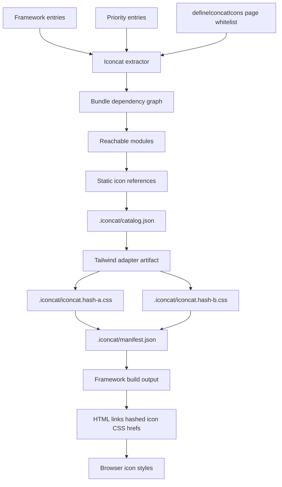
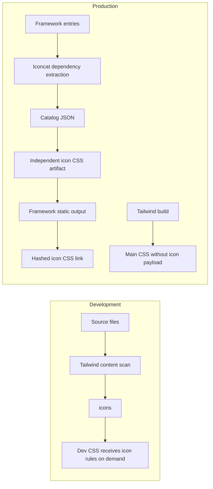
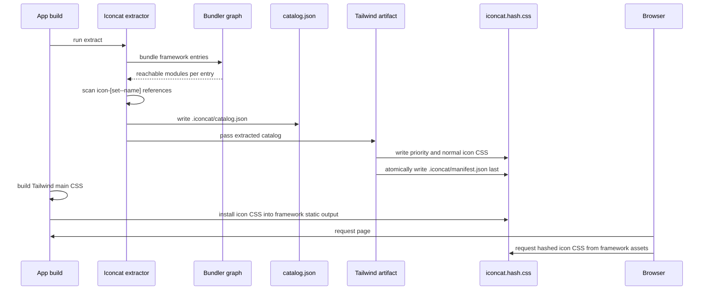
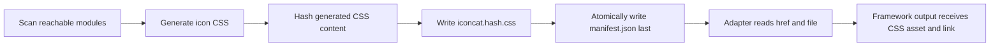
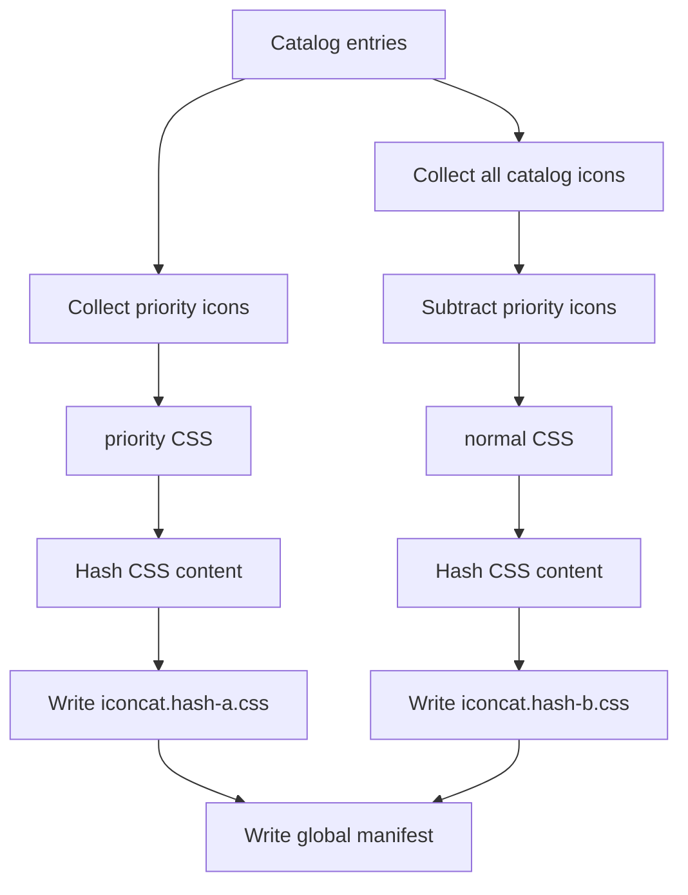
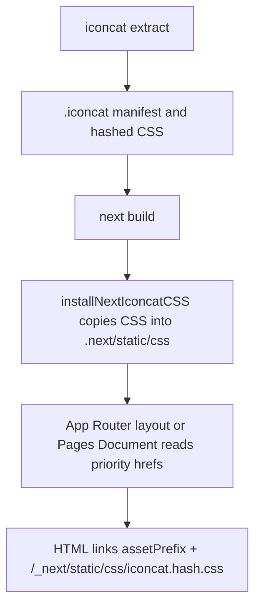
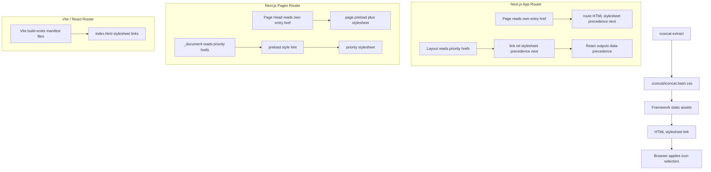

# Iconcat Catalog Extraction Flow

Iconcat follows the same high-level idea as Lingui catalog extraction: start
from framework entries, traverse the reachable dependency graph, then emit a
small catalog for the assets that are actually used.

## Build Pipeline



## Development vs Production



## Sequence



## Artifact Layout

```text
app build
├─ Tailwind main CSS
│  └─ application utilities, layout, and component styles
├─ framework static output
│  ├─ Next.js: .next/static/css/iconcat.[hash].css
│  └─ Vite: dist/assets/iconcat.[hash].css
├─ .iconcat/iconcat.[hash-a].css
│  └─ shell/layout icon selectors, referenced as manifest.files.priority
├─ .iconcat/iconcat.[hash-b].css
│  └─ remaining catalog-limited icon selectors, referenced as manifest.files.normal
├─ .iconcat/manifest.json
│  └─ current hashed priority and normal icon CSS hrefs
└─ .iconcat/catalog.json
   └─ normalized icon catalog and per-entry metadata
```

## Build Ordering

Iconcat keeps a deterministic manifest handoff even when a framework can run
extraction in parallel with its own compilation. The CSS file name is
content-hashed, and both CSS and manifest writes use same-directory temporary
files followed by atomic rename. The manifest is written last, so the framework
never observes a manifest that points at a half-written stylesheet.

- Next.js examples link `assetPrefix + /_next/static/css/iconcat.[hash].css`
  and install the extracted CSS into `.next/static/css` after `next build`.
- Vite examples link `base + /assets/iconcat.[hash].css` and emit the extracted
  CSS as a Rollup asset during `vite build`.
- Development keeps using Tailwind's dynamic icon selectors and does not run
  catalog extraction on every page interaction.

### Hashed CSS Handoff

The stable handoff between extraction and the framework build is the iconcat
manifest:



The hash is derived from the generated icon CSS content, not from a framework
bundle id. This keeps icon CSS cache invalidation independent from application
JavaScript and Tailwind output. A framework adapter should only read the
manifest after extraction finishes.

### Global CSS Layers

Set `artifactMode: 'global'` for framework builds. The artifact writer emits at
most two independent icon CSS files:

- `priority`: icons reachable from entries marked `priority: true`;
- `normal`: every other extracted icon, including icons declared through
  `defineIconcatIcons()` page whitelists.

Priority icons are subtracted from the normal layer, so the same selector is not
duplicated across the two files. Both files are globally injected by the
framework adapter in production. Page-level CSS injection is intentionally left
for a later routing-aware phase.

```ts
createIconcatCSSArtifact({
  artifactMode: 'global',
  output: '.iconcat/iconcat.[hash].css',
  manifest: '.iconcat/manifest.json',
  publicPath: '/_next/static/css',
})
```

The output path keeps one template for configuration simplicity. Iconcat expands
the `[hash]` placeholder with the generated CSS content hash only. The file name
does not encode priority; `manifest.files.priority` and `manifest.files.normal`
carry that role.



The manifest shape is:

```json
{
  "version": 1,
  "mode": "global",
  "files": {
    "priority": {
      "file": "iconcat.5b60030fc4.css",
      "hash": "5b60030fc4",
      "href": "/_next/static/css/iconcat.5b60030fc4.css",
      "icons": 1
    },
    "normal": {
      "file": "iconcat.0da9d37a19.css",
      "hash": "0da9d37a19",
      "href": "/_next/static/css/iconcat.0da9d37a19.css",
      "icons": 5
    }
  },
  "icons": 6
}
```

### Priority Entries

Entries can be strings or objects:

```ts
export default defineIconcatConfig({
  entries: [
    { file: 'src/app/layout.tsx', priority: true },
    'src/app/**/page.tsx',
  ],
})
```

`priority: true` means the entry CSS should be treated like shell CSS and linked
as early as the framework allows. It does not change icon extraction itself.
The same dependency graph traversal still runs from that entry; only the
manifest metadata and framework injection priority change.

For app-level icon needs, prefer declaring a real shell/layout entry as
priority instead of manually listing global icons in config. The icon whitelist
should live in the code that owns the feature.

### Page Whitelist API

Use `defineIconcatIcons()` in source code when a page can render icons that are
chosen by deployment-time or runtime configuration:

```tsx
import { defineIconcatIcons } from 'iconcat/runtime'

const configurableIcons = defineIconcatIcons([
  'mdi-light:chart-line',
  'mdi-light:calendar',
])
```

The helper is a zero-dependency identity function. Its job is to make the
whitelist easy to find in source while keeping page bundles free from extractor
or Node-only dependencies. Values must be static string literals so the
extractor can include them during catalog generation.

Use this for page-level flexible icon sets. App shell icons should normally be
declared in the shell/layout entry and marked `priority: true`.

### Vite Build Integration

Vite is the cleanest plugin boundary for Iconcat because it exposes both the
build lifecycle and HTML transform hooks. `@iconcat/vite` starts
`writeIconCatalog()` in `buildStart()` without awaiting it, allowing Iconcat
dependency extraction to run in parallel with the Vite application bundle.

The later Vite hooks are the synchronization barrier:

1. `generateBundle()` awaits the extraction promise, reads the final manifest,
   and emits every manifest CSS file as a Vite asset.
2. `transformIndexHtml()` awaits the same promise, reads the same manifest, and
   injects stylesheet links into `index.html`.

That makes Vite integration parallel during compilation but serial at the
manifest handoff. CSS file names remain content-addressed, and the HTML links
always point at the exact emitted assets.

The recommended Vite public path is:

```ts
import { createViteIconcatPublicPath, iconcat } from '@iconcat/vite'

export default {
  plugins: [
    iconcat({
      publicPath: createViteIconcatPublicPath('/', 'assets'),
    }),
  ],
}
```

Use the app's configured Vite `base` and `build.assetsDir` values when calling
`createViteIconcatPublicPath()`. The generated CSS is emitted through the Vite
bundle, so it behaves like a build asset rather than a file copied into
`public`.

For React Router SPA builds there is no server-rendered current route at
`index.html` generation time. In entry artifact mode, `@iconcat/vite` therefore
emits every CSS file listed by the manifest and injects stylesheet links for all
of them. With the default React Router preset this is often one file because
`src/main.tsx` and `src/App.tsx` can both reach the same client route tree.
Route-level lazy CSS for client navigation is a later adapter concern.

### Next.js Build Integration

Next.js does not currently provide a Vite-like, cross-router plugin boundary
that can both run a global dependency-tree extraction and inject an external
stylesheet into App Router, Pages Router, and Turbopack builds with one stable
API. Iconcat therefore keeps Next.js integration explicit and serial for now:



The recommended Next.js public path is:

```ts
import { createNextIconcatPublicPath } from '@iconcat/next'

const publicPath = createNextIconcatPublicPath({
  assetPrefix: process.env.NEXT_PUBLIC_ASSET_PREFIX,
})
```

The CSS should be installed into `.next/static/css` because Next's
`assetPrefix` is designed around `/_next/static` assets. It should not be put
under `public/iconcat` for production output: files in `public` require callers
to add any CDN prefix themselves, while `/_next/static` matches the asset shape
that users already configure for Next build artifacts.

TODO: investigate a Next.js build wrapper that starts Iconcat extraction in
parallel with `next build`, then blocks manifest reads before App Router layout
or Pages Router `_document` emits the stylesheet link. The wrapper must protect
against stale manifests, expose a stable await boundary for both routers, and
still install the final CSS into `.next/static/css`.

### Why Not Loader, SWC, or Turbopack Rules

Iconcat extraction is a global build task:

- start from framework entries;
- traverse the reachable dependency graph;
- merge icon references across modules;
- generate one content-hashed CSS artifact;
- write the manifest only after the CSS is complete;
- inject or render the final stylesheet href.

Webpack loaders, Turbopack rules, and SWC plugins are module transformation
boundaries. They can transform the current file, but they are not the right
owner for a whole-app graph traversal plus stable asset emission and HTML
injection. This matters more for Next.js because App Router, Pages Router, and
Turbopack have different rendering and build pipelines.

For Turbopack specifically, `turbopack.rules` currently maps files to supported
webpack loaders. That can cover single-file transforms, but it does not provide
the same full plugin surface as Vite/Rollup for emitting a cross-route
content-hashed CSS asset and injecting the final link. Keeping Next.js as
`extract -> next build -> install -> render link` is simpler, deterministic,
and works across both router implementations.

## CSS Injection Strategy

Iconcat emits an independent icon stylesheet. It is not concatenated into the
application Tailwind CSS file because the catalog CSS has a separate lifecycle:
it is generated from the extracted icon catalog and is content-hashed on its own.



### Next.js App Router

Next.js App Router has a managed stylesheet pipeline for CSS that belongs to the
route module graph. Internally, `renderCssResource` renders external CSS as a
stylesheet link with a React `precedence` prop. React then serializes that prop
as `data-precedence` in HTML and uses it to hoist, dedupe, and order stylesheet
resources.

The important distinction is input vs output:

- Use `precedence` in React JSX when opting into React's managed stylesheet
  handling.
- Treat `data-precedence` as the rendered HTML output.
- Do not add a separate `rel="preload" as="style"` link for this path.

Next also registers style preload hints for its own App Router CSS during
server rendering. A manual CSS preload link would only fetch the resource; it
would not apply the stylesheet or participate in React's stylesheet ordering and
deduplication model. That is why App Router CSS usually appears as:

```html
<link rel="stylesheet" href="/_next/static/css/app.css" data-precedence="next" />
```

instead of a hand-written preload link.

Iconcat CSS is outside Next's route CSS manifest, so Next cannot discover it
automatically. The App Router example reads `.iconcat/manifest.json` during the
server render and emits the global priority and normal stylesheet links with
`precedence="next"` from the root layout. This makes the generated HTML line up
with App Router's stylesheet model while keeping the icon CSS independently
generated:

```tsx
import { IconcatAppRouterStylesheets } from '@iconcat/next/app-router'

<head>
  <IconcatAppRouterStylesheets />
</head>
```

The App Router component is a server-side helper. It returns `null` outside
production, reads the extracted manifest during `next build` or SSR, and writes
React stylesheet links directly. It does not emit manual preload links because
React's managed stylesheet path handles ordering and deduplication through
`precedence`.

### Pages Router and Vite

Pages Router uses Next's legacy document head pipeline. Next emits preload hints
for CSS files that are part of its build manifest, but iconcat CSS is generated
outside that manifest. Iconcat keeps the loading model explicit and global:

- `_document.tsx` wraps `Head` with `createIconcatDocumentHead`;
- the wrapper preloads priority CSS, then appends stylesheet links for both
  priority and normal Iconcat CSS files;
- individual pages only declare configurable icon whitelists in source code.

```tsx
import { createIconcatDocumentHead } from '@iconcat/next/pages-router'
import Document, {
  Head,
  Html,
  Main,
  NextScript,
} from 'next/document'

const IconcatHead = createIconcatDocumentHead(Head)

export default class AppDocument extends Document {
  render() {
    return (
      <Html>
        <IconcatHead />
        <body>
          <Main />
          <NextScript />
        </body>
      </Html>
    )
  }
}
```

Vite owns HTML transformation during `vite build`, so the React Router example
emits the icon CSS files as Rollup assets and injects all global stylesheet
links into the generated `index.html`.

## Router Coverage

Iconcat ships presets for the common React app entry shapes:

- Next.js App Router
- Next.js Pages Router
- React Router / Vite

For multi-entry frameworks such as Next.js App Router and Pages Router, the
catalog records per-entry usage. Shared components are still counted through
the dependency graph, but unrelated page modules are not pulled in when imports
stay direct and tree-shakable.

For single-entry client routers such as React Router, the catalog represents
the app entry and the routes reachable from that entry.

## Production Preview Snapshots

Run the production preview snapshot after building the three examples:

```bash
pnpm --filter @iconcat/example-next-app-router run build
pnpm --filter @iconcat/example-next-pages-router run build
pnpm --filter @iconcat/example-react-router-vite run build
pnpm run test:production-previews
```

The Vitest suite starts each built preview server on an automatic local port,
requests the key routes, and compares a JSON snapshot covering:

- iconcat stylesheet links in rendered HTML;
- global priority and normal manifest files;
- generated CSS selectors, including page whitelist icons.

Update the baseline only after intentionally changing the production injection
shape:

```bash
pnpm run verify:production-previews:update
```
